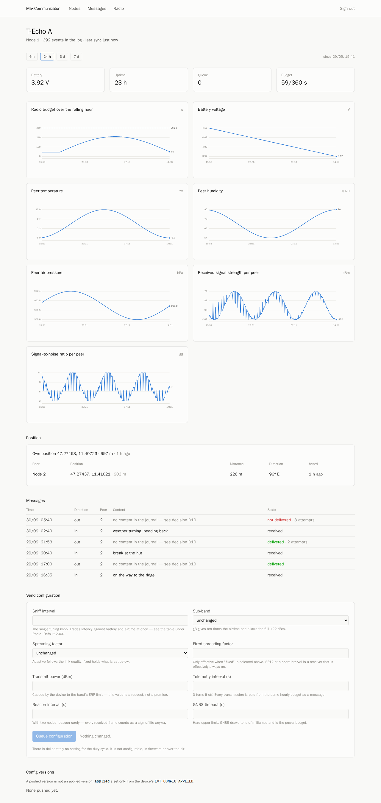
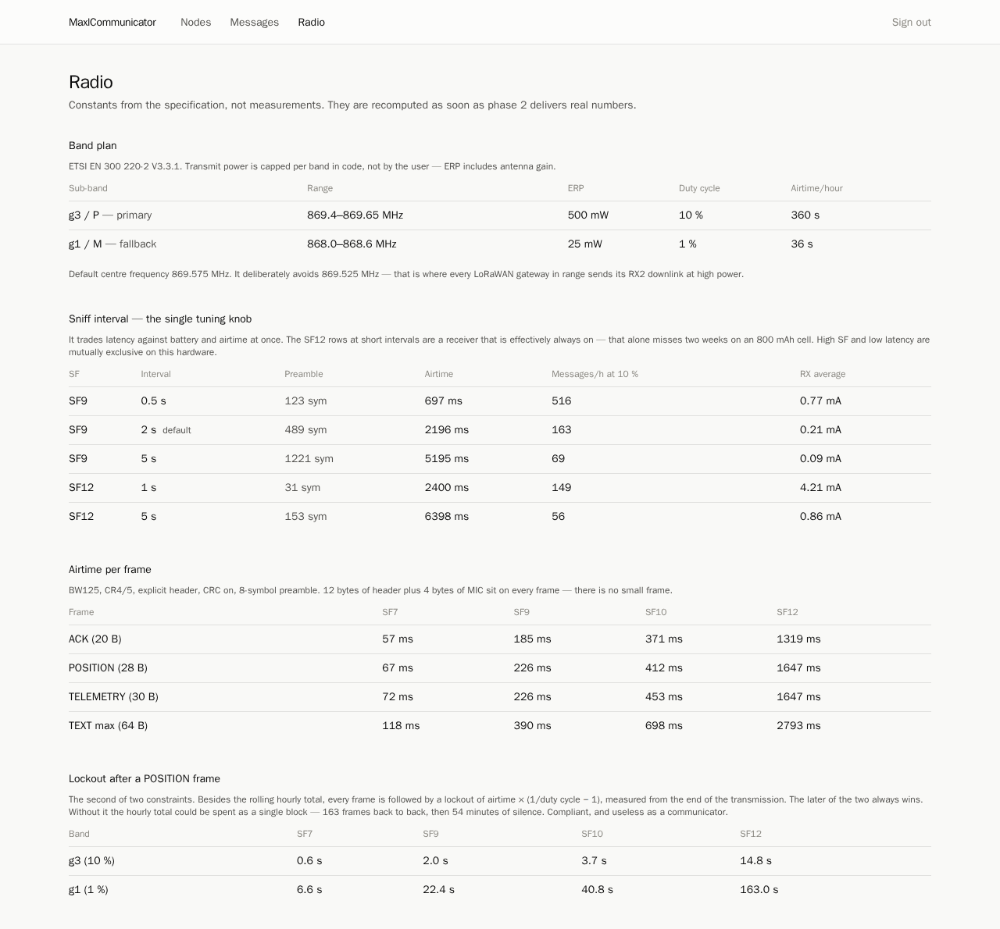
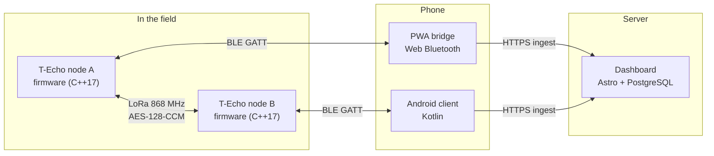

# MaxlCommunicator — a LoRa field communicator with its own firmware, phone bridge and dashboard

MaxlCommunicator turns two (or more) **LilyGO T-Echo** boards (nRF52840 + SX1262, EU 868 MHz,
e-paper) into a small encrypted text, position and telemetry link that works without any network.
Everything is written from scratch — no Meshtastic, no SoftRF: the radio protocol, the firmware,
a Web Bluetooth phone bridge (PWA), a native Android client and a server dashboard.

<p align="center">
  
  &nbsp;
  
</p>

<sub>Dashboard with synthetic seed data (`npm run seed`). A photo of the boards follows.</sub>

**`CLAUDE.md` is the normative specification.** Where this README and `CLAUDE.md` disagree,
`CLAUDE.md` wins.

## Why

A LoRa communicator is easy to make work on a desk and hard to make *right*: the EU 868 MHz band
has a legally binding duty cycle, a battery of 800 mAh has to last two weeks, a nonce must never
repeat even across power cuts, and a phone that is only sometimes in range is the only way to the
internet. This project treats those as the design, not as afterthoughts — and verifies the parts
that can be verified without hardware on every build.

## Features

- **Own radio protocol** — AES-128-CCM with a persistent 32-bit frame counter (no nonce reuse
  across reboots), replay window, stop-and-wait ARQ, adaptive spreading factor with a fixed
  rendezvous configuration, duty-cycled receive on the SX1262.
- **Legal duty cycle enforced in firmware** — rolling 60-minute budget per sub-band plus a
  per-frame lockout, persisted to flash so a power cycle cannot reset it; blocked frames are
  queued, never dropped.
- **E-paper UI** with partial refresh, ghosting control and five screens (status, messages,
  telemetry, peers, position with bearing and distance).
- **BLE GATT bridge** specified independently of any client (`docs/bridge-protocol.md`):
  a PWA (Web Bluetooth) and a native Android client implement it.
- **Dashboard** with an append-only event log, projections, per-link radio statistics, duty-cycle
  history and remote configuration.
- **Hardware-free verification**: 273 host test cases over the same sources the ARM build
  compiles, two-node simulations, shared hand-written test vectors checked by firmware, PWA and
  Kotlin client, and build guards (layering, no dynamic allocation in `link/`/`app/`, flash budget,
  a release build that refuses a development key).

## Architecture



| Component | Path | Stack |
|---|---|---|
| Device firmware | `firmware/` | PlatformIO, Adafruit nRF52 Arduino core, C++17 |
| Phone bridge | `bridge/` | PWA, Web Bluetooth, TypeScript + Vite |
| Dashboard | `web/` | Astro 7 SSR + React 19 + Tailwind v4 + Drizzle + PostgreSQL 17 |
| Native client | `android/` | Kotlin, Gradle |
| Shared test vectors | `test-vectors/` | JSON, read by firmware, bridge **and** Kotlin client |

The test vectors are written by hand from the specification and are **not** generated from any
implementation — a generator would bake one side's bugs into the other side's tests. It paid off:
while the Kotlin client was being written, a vector caught a wrong structure length at once. The
PWA parses the JSON directly; `tools/gen_vectors.py` translates it for C++ and Kotlin.

## Regulatory

This device transmits in the **EU 868 MHz SRD band** (ETSI EN 300 220-2). The default configuration
uses the **g3 sub-band (869.4–869.65 MHz, 500 mW ERP, 10 % duty cycle)** with a g1 fallback
(868.0–868.6 MHz, 25 mW, 1 %). The firmware enforces the duty cycle and caps the TX power per band;
neither is a user setting. **You are responsible for operating it in compliance with the rules
where you are.** It is not intended for use outside the EU without changes to band plan and power.
Never power a node without an antenna attached.

## Quick start without hardware

Everything that is pure computation runs on a normal machine (Docker for the firmware tests):

```bash
firmware/tools/hosttest.sh                   # firmware unit tests + two simulations, in Docker
python3 firmware/scripts/check_layering.py   # layering rules (CLAUDE.md §3)
python3 firmware/scripts/check_no_alloc.py   # no malloc/new in link/ and app/
python3 firmware/scripts/check_size.py       # flash and RAM budget (gate 0.6), after a build

cd bridge && npm ci && npm test              # bridge protocol and PWA, against the test vectors
cd web && npm ci && npm run db:up && npm run db:migrate && npm test   # dashboard, real PostgreSQL 17

android/tools/test.sh                        # Kotlin protocol core, in Docker
android/tools/test.sh :app:testDebugUnitTest # connection flow and event store (needs the Android SDK)
```

`web/` needs a `.env` first: `cp web/.env.example web/.env` and fill in the values it asks for.

Green on the host means the logic is consistent — not that it runs on the nRF52840. Every gate in
`docs/test-plan.md` except 2.15 needs hardware, most of them two devices.

## Building the firmware

```bash
python3 -m venv .venv
.venv/bin/python -m pip install "platformio==6.1.19"

cd firmware
../.venv/bin/python -m platformio run -e debug              # build
../.venv/bin/python -m platformio run -e debug -t upload    # flash
../.venv/bin/python -m platformio device monitor
```

On Ubuntu 24.04 `python3 -m venv` ships without pip unless `python3-venv` is installed; use
`python3 -m venv --without-pip .venv` plus `get-pip.py`. The upload uses `nrfutil` on the serial
port with a 1200-bps touch, not the bootloader's drive letter.

The network key is provisioned over BLE at runtime. For bench work a development key can come from
the environment variable `MAXL_DEV_KEY` — never from a file — and a release build with it set
fails on purpose (`CLAUDE.md` §6).

## Bring-up on the device

```bash
cp firmware/nodes.example.ini firmware/nodes.ini   # put your boards' USB serials in
tools/nodes.py --list                    # which node is on which port
tools/morning.sh --node A                # all open bring-up sketches in order
tools/bringup_run.py 7 --node A          # or one at a time: build, flash, collect the report
tools/bringup_run.py 12 --node A         # the whole stack except radio, on the panel
tools/bringup_run.py 20 --node A         # writes the node letter on the panel
tools/rtc_test.py set-and-reset --node B # gate 0.5 -- overwrites the clock!
tools/night.sh                           # the three self-resetting sketches, unattended
```

`--node` is not optional with two boards attached: which one becomes `/dev/ttyACM0` depends only on
plug order. `tools/nodes.py` resolves the letter via the USB serial in `firmware/nodes.ini`; with
two boards and no `--node` it aborts instead of guessing.

A **dead-man task** (`firmware/src/hal/deadman.h`) recovers a hung image — a debug build jumps to
the UF2 bootloader, a release build reboots — which is what makes unattended flashing safe
(`docs/test-results/2026-08-31_deadman_survives_hung_loop.md`).

### When a node does not boot any more

1. **Double-click reset** always enters the UF2 bootloader (drive `TECHOBOOT`), whatever the
   application does, as long as `PSELRESET` is untouched — and it is in this project.
2. `python tools/uf2_inspect.py` reads the whole flash and tells whether and where an application
   is present.
3. If the device disappears from USB entirely and does not come back after a double-click, the
   host's USB port has usually given up (`device not accepting address … error -71`): replug.

`-Wframe-larger-than=1024` is set because the loop task has 4096 bytes of stack: a stack overflow
before TinyUSB enumerates leaves no port to recover through except the double-click.

### Two things that cost hardware

- **Never power a node without an antenna.** It destroys the SX1262's PA — flashing included.
- **Never drive P0.13 low.** It is the 3.3 V regulator enable, not the red LED; Meshtastic's pin
  map comes from an older hardware revision (`docs/hardware/pinmap.md`).

## Documentation

| File | Content |
|---|---|
| `CLAUDE.md` | Normative specification: radio protocol, architecture, phase plan |
| `REVIEW.md` | Review of the first revision — why the spec looks the way it does |
| `docs/protocol.md` | Wire format changelog |
| `docs/bridge-protocol.md` | Phone-to-device protocol, client-independent |
| `docs/versioning-and-updates.md` | The three version numbers, updates, key rotation |
| `docs/test-plan.md` | Gates per phase with pass criteria |
| `docs/test-results/` | What was actually measured, per gate, with numbers |
| `docs/hardware/ground-truth.md` | Facts measured on the device (bootloader, SoftDevice, flash map) |
| `docs/hardware/pinmap.md` | Pin map from four sources, with contradictions and open measurements |
| `docs/decisions/` | Recorded decisions and tensions in the spec |
| `docs/DEPLOYMENT.md` | Running the dashboard and serving the PWA |
| `firmware/README.md`, `bridge/README.md`, `web/README.md`, `android/README.md` | Per component: state, structure, how to test it |

## Status

Work in progress, and the reports say exactly how far: the code covers phases 0–7 and most of
phase 9 (native Android client). **Passed on real hardware:** gates of phase 0 (flash, size budget,
tickless idle), 1.1 (partial refresh), 2.15 (crypto self-test on the device), 4.1 (UI), 6.9
(foreground sync UX) and 7.1–7.4 (dashboard). **Not yet passed:** the two-node radio gates of
phase 2 (the link has delivered its first message; the ACK return path still loses
acknowledgements — 58 sent, 0 seen in the last run),
phase 3 and 6.3–6.6 (green in simulation only, deliberately not claimed) and the power measurements
of phase 5. Phase 8 (map tiles) is not started. Every report is in `docs/test-results/`, including
what each run does *not* answer; `docs/test-results/README.md` is the index. "Green in simulation"
is never counted as passed.

**Known issues that matter before anyone relies on it** (tracked as issues): the ARQ computes
data-frame airtime with an 8-symbol preamble while frames go out with ~123, so the duty-cycle budget
is underestimated for data frames; and the replay window is not persisted, so a captured frame can
be replayed against a freshly rebooted receiver.

## Contributing

Issues and pull requests are welcome — see [CONTRIBUTING.md](CONTRIBUTING.md). Radio behaviour
changes need a bench test with two devices before they count as done. Security problems: see
[SECURITY.md](SECURITY.md).

## Built with Claude Code

Most of this project was written in pair-programming sessions with
[Claude Code](https://claude.com/claude-code), Anthropic's coding agent: the specification review,
firmware, bridge, dashboard, Android client, tests and the hardware bring-up tooling. Hardware
decisions, measurements on the bench and review are the maintainer's. [`CLAUDE.md`](CLAUDE.md) is
the specification the agent works against.

## License

[MIT](LICENSE) © Max Oberrauch. Firmware images link GxEPD2 (GPL-3.0) and are therefore
distributed under GPL-3.0; see [THIRD_PARTY.md](THIRD_PARTY.md).
